# Membuat-Layout-Sederhana
This project is an assignment from my class
#### NIM : 312110103
#### Kelas : TI.21.A2
#### MatKul : Pemrograman Weh 2

### Penjelasan 
Ini adalah Layout Web Sederhana
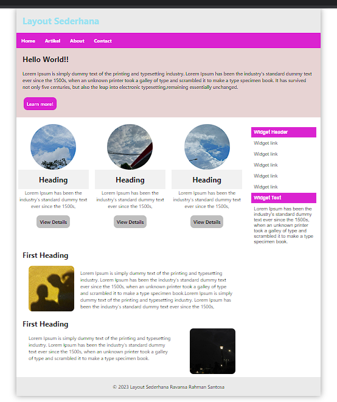

### Pertama Bentuk dari Header 
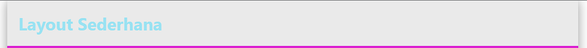
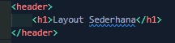

### Kedua Bentuk dari Navbar
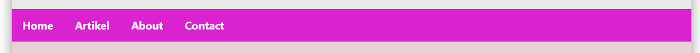
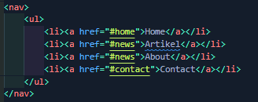

### Ketiga bentuk dari Section 1
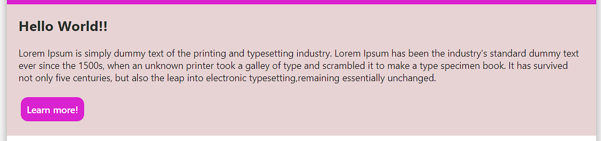
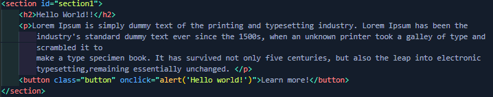

### Keempat Menggunakan Fungsi Card (Section 2)
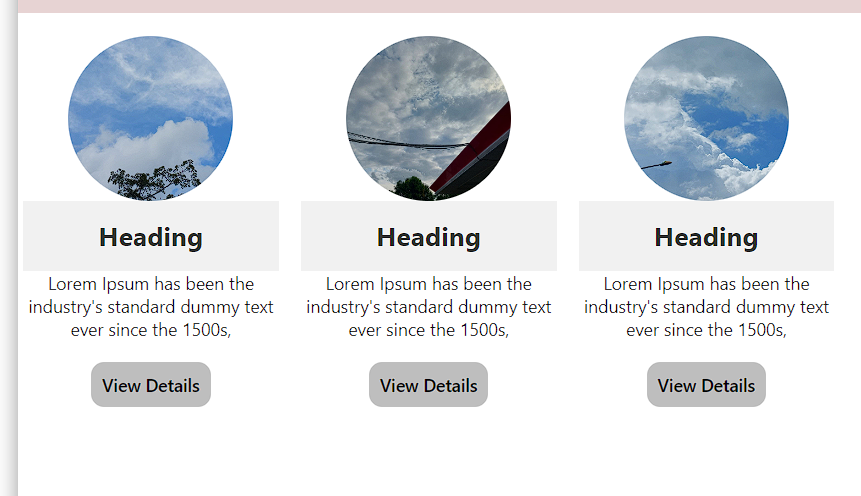
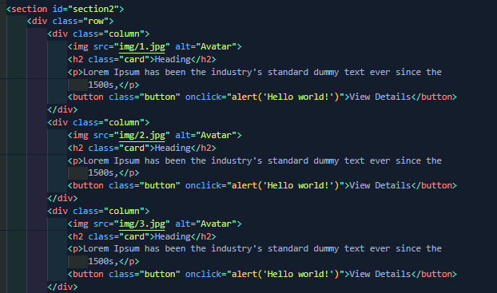

### Kelima Menggunakan Fungsi Table

### Keenam adalah Section 3
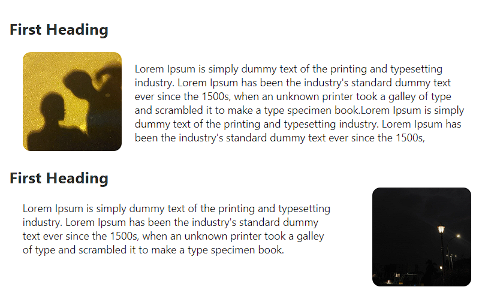
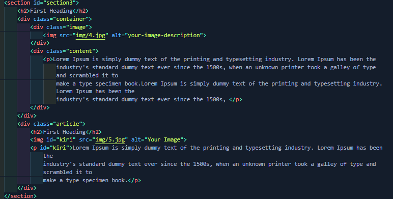

### Ketujuh adalah Footer

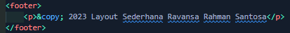

## Sekian Dan Terimakasih
Code ini Jauh Dari Sempurna Saran dan Kritik Di Persilahkan