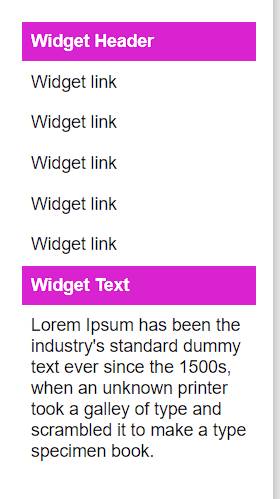
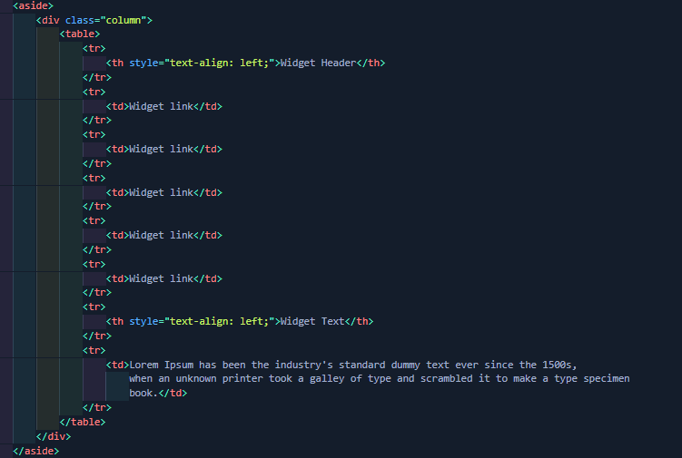

# Membuat-Layout-Sederhana
This project is an assignment from my class
#### NIM : 312110103
#### Kelas : TI.21.A2
#### MatKul : Pemrograman Weh 2

### Penjelasan 
Ini adalah Layout Web Sederhana

### Pertama Bentuk dari Header 

### Kedua Bentuk dari Navbar

### Ketiga bentuk dari Section 1

### Keempat Menggunakan Fungsi Card (Section 2)

### Kelima Menggunakan Fungsi Table

### Keenam adalah Section 3

### Ketujuh adalah Footer

## Sekian Dan Terimakasih
Code ini Jauh Dari Sempurna Saran dan Kritik Di Persilahkan